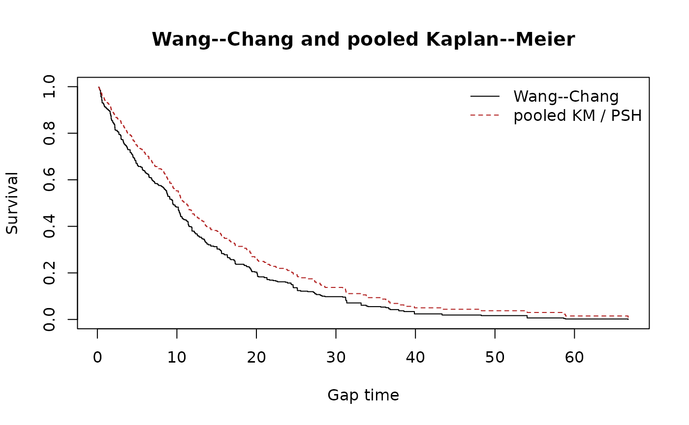

# Wang--Chang reference implementation check

## Purpose

This check compares
[`wc_surv()`](https://muschellij2.github.io/recurSurvTests/reference/wc_surv.md)
with the Wang–Chang estimators exposed by `survrec::wc.fit()` and
`newTestSurvRec::WC.fit()` on exactly the same simulated recurrent
gap-time records. It is a numerical regression check of the estimator,
not a comparison of the packages’ recurrent rank tests.

## Estimands and simulated curves

For subject $`i`$, let $`m_i^*=1`$ if the subject has no completed event
and otherwise let $`m_i^*`$ be its number of completed gaps. Wang–Chang
uses

``` math
R_{WC}(t)=\sum_i\frac{1}{m_i^*}\sum_{j=1}^{m_i^*}I(Y_{ij}\ge t),\qquad
dN_{WC}(t)=\sum_i\frac{1}{m_i^*}\sum_{j=1}^{m_i^*}I(Y_{ij}=t,\delta_{ij}=1),
```

with $`\widehat S_{WC}(t)=\prod_{u\le t}\{1-dN_{WC}(u)/R_{WC}(u)\}`$. In
contrast, standard pooled Kaplan–Meier gives every gap record unit
weight: $`R_{KM}(t)=\sum_{i,j}I(Y_{ij}\ge t)`$ and
$`dN_{KM}(t)=\sum_{i,j}I(Y_{ij}=t,\delta_{ij}=1)`$. The latter is
numerically the PSH curve in this long gap-time representation, but has
a renewal/IID interpretation rather than Wang–Chang’s marginal
interpretation.

``` r

set.seed(20260918)
n_event <- sample(1:5, 100, replace = TRUE)
simulated_gaps <- do.call(rbind, lapply(seq_along(n_event), function(i) {
  k <- n_event[i]
  data.frame(id = i, episode = seq_len(k + 1L),
    gap = stats::rexp(k + 1L, rate = 1 / 12), status = c(rep(1L, k), 0L))
}))
wc <- wc_surv(simulated_gaps, episode = "episode")
km <- psh_surv(simulated_gaps, episode = "episode")
grid <- sort(unique(c(wc$time, km$time)))
step_value <- function(fit, time) vapply(time, function(t) {
  ii <- which(fit$time <= t)
  if (length(ii)) fit$surv[max(ii)] else 1
}, numeric(1))
wc_at_grid <- step_value(wc, grid)
km_at_grid <- step_value(km, grid)
plot(grid, wc_at_grid, type = "s", ylim = c(0, 1), xlab = "Gap time",
     ylab = "Survival", main = "Wang--Chang and pooled Kaplan--Meier")
lines(grid, km_at_grid, type = "s", col = "firebrick", lty = 2)
legend("topright", c("Wang--Chang", "pooled KM / PSH"),
       col = c("black", "firebrick"), lty = c(1, 2), bty = "n")
```



``` r

plot(grid, wc_at_grid - km_at_grid, type = "s", xlab = "Gap time",
     ylab = expression(hat(S)[WC] - hat(S)[KM]),
     main = "Difference: Wang--Chang minus pooled KM")
abline(h = 0, lty = 2, col = "grey40")
```


The reference packages are deliberately not dependencies of
`recurSurvTests`. Install them and run the chunk below interactively
when updating either the estimator or its data conversion.

``` r

library(recurSurvTests)
stopifnot(
  requireNamespace("survrec", quietly = TRUE),
  requireNamespace("newTestSurvRec", quietly = TRUE)
)

simulate_gaps <- function(seed, n, event_range, rate) {
  set.seed(seed)
  n_event <- sample(event_range, n, replace = TRUE)
  do.call(rbind, lapply(seq_len(n), function(i) {
    k <- n_event[i]
    data.frame(
      id = i,
      episode = seq_len(k + 1L),
      gap = stats::rexp(k + 1L, rate = rate),
      status = c(rep(1L, k), 0L)
    )
  }))
}

compare_wc <- function(dat) {
  ours <- wc_surv(dat, episode = "episode")
  survrec_fit <- survrec::wc.fit(
    survrec::Survr(dat$id, dat$gap, dat$status)
  )
  new_test_fit <- newTestSurvRec::WC.fit(
    as.matrix(dat[, c("id", "gap", "status")])
  )
  stopifnot(identical(ours$time, survrec_fit$time))
  data.frame(
    n_event_times = nrow(ours),
    max_abs_wc_surv_vs_survrec = max(abs(ours$surv - survrec_fit$survfunc)),
    max_abs_wc_surv_vs_newTestSurvRec = max(abs(ours$surv - new_test_fit$survfunc))
  )
}

scenario_1 <- simulate_gaps(20260918, n = 100, event_range = 1:5, rate = 1 / 12)
scenario_2 <- simulate_gaps(20260919, n = 80, event_range = 0:6, rate = 1 / 9)
rbind(
  cbind(scenario = "1--5 completed events/person", compare_wc(scenario_1)),
  cbind(scenario = "0--6 completed events/person", compare_wc(scenario_2))
)
```

## Recorded result

Using `survrec` 1.2.5 and `newTestSurvRec` 1.0.2, the comparison gave:

| Scenario | [`wc_surv()`](https://muschellij2.github.io/recurSurvTests/reference/wc_surv.md) vs `survrec` | [`wc_surv()`](https://muschellij2.github.io/recurSurvTests/reference/wc_surv.md) vs `newTestSurvRec` |
|:---|---:|---:|
| 100 subjects, 1–5 completed events/person | 1.05e-15 | 3.33e-9 |
| 80 subjects, 0–6 completed events/person | 5.55e-17 | 5.00e-9 |

The `survrec` agreement is at floating-point precision. `newTestSurvRec`
rounds its returned survival curve to eight decimal places, which
explains its small residual difference. The second scenario includes
subjects with no completed event, confirming the convention under which
their terminal censored gap contributes to the weighted risk set.

## References

Wang MC, Chang SH (1999). Nonparametric estimation of a recurrent
survival function. *Journal of the American Statistical Association*,
94, 146–153.

Pena EA, Strawderman RL, Hollander M (2001). Nonparametric estimation
with recurrent event data. *Journal of the American Statistical
Association*, 96, 1299–1315. <doi:10.1198/016214501753381887>.
