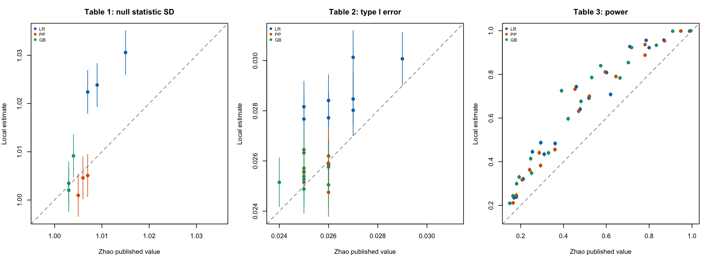

# Validation against Zhao et al. (2020) simulations

Generated: 2026-09-23 14:38:12 UTC.

## Assessment

**Published-table reproduction is not established.** 86 of 120 planned cells are available; 86 are comparable under the design audit below. Of these, 26 are compatible and 60 are discrepant using the exploratory Monte Carlo criterion defined below.

These results assess `zhao_rank_test(variance_method = "pooled_risk")` against the paper's **New method** columns. They do not establish that the implementation reproduces the printed Equation 6 variance, and they do not validate `wc_logrank()` (the separate Luo–Huang test).

| Table | Planned | Available | Comparable | Compatible | Discrepant |
| --- | --- | --- | --- | --- | --- |
| table1 | 12 | 9 | 9 | 6 | 3 |
| table2 | 36 | 24 | 24 | 20 | 4 |
| table3 | 72 | 53 | 53 | 0 | 53 |

Among available, design-comparable Table 2 cells, 8 of 24 differ from nominal 0.025 after Holm adjustment over all 36 planned cells (exact two-sided binomial tests, familywise 0.05). Agreement with a paper estimate and calibration to nominal alpha are separate questions.

Across available comparable power cells, local minus published power ranges from +0.46 to +33.44 percentage points. These differences require investigation of both the data-generating design and the implementation; this report does not identify a unique cause.

The largest available power difference is weibull / low heterogeneity / gehan_breslow / log-time shift 0.25: local 0.7254 versus Zhao 0.391 (difference +0.3344).



Vertical bars show approximate local 95% Monte Carlo intervals; the diagonal denotes equality. The classification uses uncertainty from both simulations plus paper rounding. Missing cells and the log-logistic design mismatch are excluded from this figure.

## Source and benchmark interpretation

Zhao Q, Zhang B, LaValley MP, Massaro JM, Lunetta KL, Chang M (2020). *Extended Rank Tests for Analyzing Recurrent Event Data*. Statistics in Biopharmaceutical Research 12(1):90–98. [DOI](https://doi.org/10.1080/19466315.2019.1601596). Benchmarks were transcribed from the locally supplied publisher PDF: Table 1, page 93; Table 2, page 94; Table 3, page 95. Only the New method LR, PP, and GB columns are used.

**Table 2 scale ambiguity:** the caption says `(*100)`, but the cells visibly print 27, 26, 25, etc. Section 3.2 specifies one-sided alpha 0.025 and describes controlled type I error. This report interprets 27 as 0.027, dividing the printed values by 1000. This inference is not author-confirmed. All Table 2 benchmark comparisons are conditional on it; the raw printed values are preserved in the reference CSV.

LR = log-rank, PP = Peto–Prentice, GB = Gehan–Breslow. These tests target marginal recurrent **gap-time survival**, not cumulative event burden over calendar time or recurrent cause-specific cumulative incidence.

## Design audit

The paper uses 100 subjects per group, study end 180, entry U(0,180), and subject gap multipliers Z drawn from U(0.5,1.5), U(0.1,1.9), or U(0.01,1.99). Tables 1–2 use 100,000 datasets per cell; Table 3 uses 10,000. Local metadata is checked against the subject count and follow-up; actual replicate counts appear below. Local seeds and the generator are different from the paper's `survsim::rec.ev.surv()` implementation. The paper also describes noninformative censoring without supplying its full generating parameters in Section 3; the local generator uses administrative censoring only. Exact design equivalence cannot be assumed.

For exponential, Weibull, and log-normal baseline gaps, the current source matches the distributions printed in Table 1: rate exp(-4); Weibull shape 2 and scale exp(4); and log-normal meanlog 4, sdlog 0.5. Table 3 multiplies treatment gaps by exp(0.25) or exp(0.5). For Weibull shape 2, these correctly correspond to changes of 0.5 or 1 in -log(lambda).

**Log-logistic mismatch:** Table 1 specifies S(t) = 1 / [1 + (lambda*t)^(1/gamma)], lambda = exp(-4), gamma = 0.5. An inverse draw is `exp(4) * (U^(-1) - 1)^0.5`, with mean exp(4)*pi/2, approximately 85.76. The legacy generator used `exp(-4) * (U^(-0.5) - 1)^0.5`, with mean exp(-4)*pi/4, approximately 0.01438. Both the scale and inverse transform were incorrect. The production generator is now corrected. New outputs tagged `zhao_table1_loglogistic_v2` are eligible for comparison; unversioned log-logistic outputs remain excluded as design mismatch. Other distributions are unaffected by this correction.

All supplied outputs in this report must share the same variance method. `pooled_risk` uses a pooled-risk residual; `zhao_eq6` is the separate group-risk residual convention printed in Equation 6. Calibration of one does not settle the validity or intended interpretation of the other.

### Why every fourth array task can exhaust memory

Task IDs 4, 8, 12, and so on select log-logistic gaps. Under the legacy incorrect draw, a renewal approximation gives roughly 1.37, 2.05, and 3.35 million completed events per null dataset at low, medium, and high heterogeneity: 200*90*E(1/Z)/E(base gap), with E(1/Z)=log(b/a)/(b-a). Almost all continuous event times are distinct. Each dense 200-by-event-count double matrix therefore occupies about 2.05, 3.05, or 4.98 GiB. The rank test retains roughly six such matrices, with additional temporary arrays. Across four workers, those six matrices alone account for approximately 49, 73, or 120 GiB. These are approximate typical null-design allocations, not guaranteed peak bounds. A 25 GiB allocation is consequently insufficient for the legacy generator. The nested risk-set calculations also become extremely slow.

A separate corrected-generator sizing pilot (`data-raw/zhao-2020-memory-pilot.R`) draws five null datasets at each heterogeneity level in an isolated R environment. The September 23, 2026 local macOS run produced 222–676 completed events per dataset and a maximum resident set size of 196,788,224 bytes (about 188 MiB) for one R process. This is a small pilot, not a cluster or full-run peak measurement. With the corrected production generator, retaining 16–25 GiB total per four-worker task is a conservative starting allocation; measure cluster MaxRSS on a short pilot before scaling up. Increasing memory for the incorrect generator would not make its results a validation of Zhao's simulations.

## Monte Carlo comparison method

For rejection rates, the local Monte Carlo SE is sqrt(p*(1-p)/n); local 95% intervals use Wilson's formula. The paper SE uses its reported probability and replicate count. A cell is flagged discrepant when |local - paper| exceeds 1.96*sqrt(SE_local^2 + SE_paper^2) + 0.0005. The final term allows half a unit of paper rounding. Independent simulation runs are assumed. This is an exploratory cellwise screen, not an equivalence test or a multiplicity-adjusted global pass/fail rule. Compatible means no discrepancy detected by this screen, not proven equality.

Table 1 compares empirical SDs, using the normal-theory approximation SE(SD) = SD/sqrt(2*(n-1)) for both runs. This is approximate because replicate-level fourth moments are unavailable. It does not test tail behavior or the full null distribution. Raw replicate z scores and p values were not retained in the array RDS files. Although nonfinite summary moments are rejected by this aggregator, the original driver's rejection count used `na.rm = TRUE`; failed-p-value counts cannot be independently audited from these summaries.

## Completeness and provenance

Missing task IDs: 4, 8, 12, 16, 20, 21, 24, 28, 32, 33, 36, 37, 40, 44, 48, 52, 56, 60, 64, 68, 72, 76, 80, 84, 88, 92, 94, 96, 100, 104, 108, 112, 116, 120.

The aggregator rejects duplicate task IDs, duplicate cells, inconsistent settings, unexpected task-to-cell mappings, invalid counts, nonfinite moments, and inconsistent Monte Carlo SEs. All 120 planned cells are retained in the tables and CSV; missing results are not treated as zero rejections. `input-manifest.csv` records input MD5 checksums; `source-manifest.csv` records the current reference, driver, implementation, and reporting sources. These are current-source checksums: the original RDS files do not record the execution commit or source hashes, so the historical code cannot be proven from these files. The design audit distinguishes the legacy generator from the corrected version recorded in new output metadata. Runtime settings and R session information are in `session-info.txt`.

## Cell-by-cell comparison

Differences are local minus published, on the SD scale for Table 1 and probability scale for Tables 2–3 (multiply by 100 for percentage points). A dash means the task is unavailable. Heterogeneity is low U(0.5,1.5), medium U(0.1,1.9), or high U(0.01,1.99).

### Table 1: null statistic SD

| Task | Distribution | Heterogeneity | Test | Shift | N | Zhao | Local | Difference | MCSE | Result | Mean_z |
| --- | --- | --- | --- | --- | --- | --- | --- | --- | --- | --- | --- |
| 1 | exponential | medium | LR | 0.00 | 100000 | 1.007 | 1.0224 | 0.0154 | 0.0023 | discrepant | -0.0023 |
| 2 | weibull | medium | LR | 0.00 | 100000 | 1.015 | 1.0306 | 0.0156 | 0.0023 | discrepant | 0.0006 |
| 3 | lognormal | medium | LR | 0.00 | 100000 | 1.009 | 1.0238 | 0.0148 | 0.0023 | discrepant | 0.0059 |
| 4 | loglogistic | medium | LR | 0.00 | — | 1.009 | — | — | — | missing | — |
| 5 | exponential | medium | PP | 0.00 | 100000 | 1.005 | 1.0010 | -0.0040 | 0.0022 | compatible | -0.0013 |
| 6 | weibull | medium | PP | 0.00 | 100000 | 1.007 | 1.0051 | -0.0019 | 0.0022 | compatible | -0.0087 |
| 7 | lognormal | medium | PP | 0.00 | 100000 | 1.006 | 1.0046 | -0.0014 | 0.0022 | compatible | 0.0034 |
| 8 | loglogistic | medium | PP | 0.00 | — | 0.997 | — | — | — | missing | — |
| 9 | exponential | medium | GB | 0.00 | 100000 | 1.004 | 1.0092 | 0.0052 | 0.0023 | compatible | 0.0001 |
| 10 | weibull | medium | GB | 0.00 | 100000 | 1.003 | 1.0035 | 0.0005 | 0.0022 | compatible | 0.0006 |
| 11 | lognormal | medium | GB | 0.00 | 100000 | 1.003 | 1.0020 | -0.0010 | 0.0022 | compatible | -0.0063 |
| 12 | loglogistic | medium | GB | 0.00 | — | 0.998 | — | — | — | missing | — |


### Table 2: type I error

| Task | Distribution | Heterogeneity | Test | Shift | N | Zhao | Local | Difference | MCSE | Result | Local 95% CI | Nominal Holm p |
| --- | --- | --- | --- | --- | --- | --- | --- | --- | --- | --- | --- | --- |
| 13 | exponential | low | LR | 0.00 | 100000 | 0.027 | 0.0280 | 0.0010 | 0.0005 | compatible | 0.0270–0.0291 | 0.0000 |
| 14 | weibull | low | LR | 0.00 | 100000 | 0.029 | 0.0301 | 0.0011 | 0.0005 | compatible | 0.0290–0.0311 | 0.0000 |
| 15 | lognormal | low | LR | 0.00 | 100000 | 0.027 | 0.0301 | 0.0031 | 0.0005 | discrepant | 0.0291–0.0312 | 0.0000 |
| 16 | loglogistic | low | LR | 0.00 | — | 0.026 | — | — | — | missing | — | — |
| 17 | exponential | medium | LR | 0.00 | 100000 | 0.026 | 0.0284 | 0.0024 | 0.0005 | discrepant | 0.0274–0.0295 | 0.0000 |
| 18 | weibull | medium | LR | 0.00 | 100000 | 0.027 | 0.0285 | 0.0015 | 0.0005 | compatible | 0.0275–0.0295 | 0.0000 |
| 19 | lognormal | medium | LR | 0.00 | 100000 | 0.025 | 0.0277 | 0.0027 | 0.0005 | discrepant | 0.0267–0.0287 | 0.0000 |
| 20 | loglogistic | medium | LR | 0.00 | — | 0.026 | — | — | — | missing | — | — |
| 21 | exponential | high | LR | 0.00 | — | 0.026 | — | — | — | missing | — | — |
| 22 | weibull | high | LR | 0.00 | 100000 | 0.025 | 0.0282 | 0.0032 | 0.0005 | discrepant | 0.0272–0.0292 | 0.0000 |
| 23 | lognormal | high | LR | 0.00 | 100000 | 0.026 | 0.0277 | 0.0017 | 0.0005 | compatible | 0.0267–0.0288 | 0.0000 |
| 24 | loglogistic | high | LR | 0.00 | — | 0.025 | — | — | — | missing | — | — |
| 25 | exponential | low | PP | 0.00 | 100000 | 0.026 | 0.0262 | 0.0002 | 0.0005 | compatible | 0.0252–0.0272 | 0.4030 |
| 26 | weibull | low | PP | 0.00 | 100000 | 0.026 | 0.0259 | -0.0001 | 0.0005 | compatible | 0.0249–0.0269 | 1.0000 |
| 27 | lognormal | low | PP | 0.00 | 100000 | 0.025 | 0.0265 | 0.0014 | 0.0005 | compatible | 0.0255–0.0275 | 0.0990 |
| 28 | loglogistic | low | PP | 0.00 | — | 0.026 | — | — | — | missing | — | — |
| 29 | exponential | medium | PP | 0.00 | 100000 | 0.025 | 0.0255 | 0.0005 | 0.0005 | compatible | 0.0246–0.0265 | 1.0000 |
| 30 | weibull | medium | PP | 0.00 | 100000 | 0.026 | 0.0259 | -0.0001 | 0.0005 | compatible | 0.0249–0.0269 | 1.0000 |
| 31 | lognormal | medium | PP | 0.00 | 100000 | 0.025 | 0.0251 | 0.0001 | 0.0005 | compatible | 0.0242–0.0261 | 1.0000 |
| 32 | loglogistic | medium | PP | 0.00 | — | 0.025 | — | — | — | missing | — | — |
| 33 | exponential | high | PP | 0.00 | — | 0.026 | — | — | — | missing | — | — |
| 34 | weibull | high | PP | 0.00 | 100000 | 0.025 | 0.0256 | 0.0006 | 0.0005 | compatible | 0.0246–0.0266 | 1.0000 |
| 35 | lognormal | high | PP | 0.00 | 100000 | 0.026 | 0.0248 | -0.0012 | 0.0005 | compatible | 0.0238–0.0257 | 1.0000 |
| 36 | loglogistic | high | PP | 0.00 | — | 0.025 | — | — | — | missing | — | — |
| 37 | exponential | low | GB | 0.00 | — | 0.026 | — | — | — | missing | — | — |
| 38 | weibull | low | GB | 0.00 | 100000 | 0.025 | 0.0254 | 0.0004 | 0.0005 | compatible | 0.0244–0.0264 | 1.0000 |
| 39 | lognormal | low | GB | 0.00 | 100000 | 0.026 | 0.0250 | -0.0009 | 0.0005 | compatible | 0.0241–0.0260 | 1.0000 |
| 40 | loglogistic | low | GB | 0.00 | — | 0.025 | — | — | — | missing | — | — |
| 41 | exponential | medium | GB | 0.00 | 100000 | 0.026 | 0.0258 | -0.0002 | 0.0005 | compatible | 0.0248–0.0268 | 1.0000 |
| 42 | weibull | medium | GB | 0.00 | 100000 | 0.025 | 0.0263 | 0.0013 | 0.0005 | compatible | 0.0253–0.0273 | 0.2150 |
| 43 | lognormal | medium | GB | 0.00 | 100000 | 0.025 | 0.0257 | 0.0007 | 0.0005 | compatible | 0.0247–0.0267 | 1.0000 |
| 44 | loglogistic | medium | GB | 0.00 | — | 0.025 | — | — | — | missing | — | — |
| 45 | exponential | high | GB | 0.00 | 100000 | 0.025 | 0.0249 | -0.0001 | 0.0005 | compatible | 0.0239–0.0259 | 1.0000 |
| 46 | weibull | high | GB | 0.00 | 100000 | 0.024 | 0.0251 | 0.0011 | 0.0005 | compatible | 0.0242–0.0261 | 1.0000 |
| 47 | lognormal | high | GB | 0.00 | 100000 | 0.025 | 0.0253 | 0.0003 | 0.0005 | compatible | 0.0243–0.0263 | 1.0000 |
| 48 | loglogistic | high | GB | 0.00 | — | 0.024 | — | — | — | missing | — | — |


### Table 3: power

| Task | Distribution | Heterogeneity | Test | Shift | N | Zhao | Local | Difference | MCSE | Result |
| --- | --- | --- | --- | --- | --- | --- | --- | --- | --- | --- |
| 49 | exponential | low | LR | 0.25 | 10000 | 0.212 | 0.3209 | 0.1089 | 0.0047 | discrepant |
| 50 | weibull | low | LR | 0.25 | 10000 | 0.460 | 0.7437 | 0.2837 | 0.0044 | discrepant |
| 51 | lognormal | low | LR | 0.25 | 10000 | 0.620 | 0.7083 | 0.0883 | 0.0045 | discrepant |
| 52 | loglogistic | low | LR | 0.25 | — | 0.325 | — | — | — | missing |
| 53 | exponential | medium | LR | 0.25 | 10000 | 0.180 | 0.2384 | 0.0584 | 0.0043 | discrepant |
| 54 | weibull | medium | LR | 0.25 | 10000 | 0.294 | 0.4871 | 0.1931 | 0.0050 | discrepant |
| 55 | lognormal | medium | LR | 0.25 | 10000 | 0.361 | 0.4834 | 0.1224 | 0.0050 | discrepant |
| 56 | loglogistic | medium | LR | 0.25 | — | 0.242 | — | — | — | missing |
| 57 | exponential | high | LR | 0.25 | 10000 | 0.169 | 0.2347 | 0.0657 | 0.0042 | discrepant |
| 58 | weibull | high | LR | 0.25 | 10000 | 0.255 | 0.4456 | 0.1906 | 0.0050 | discrepant |
| 59 | lognormal | high | LR | 0.25 | 10000 | 0.310 | 0.4345 | 0.1245 | 0.0050 | discrepant |
| 60 | loglogistic | high | LR | 0.25 | — | 0.210 | — | — | — | missing |
| 61 | exponential | low | LR | 0.50 | 10000 | 0.601 | 0.8085 | 0.2075 | 0.0039 | discrepant |
| 62 | weibull | low | LR | 0.50 | 10000 | 0.948 | 0.9985 | 0.0505 | 0.0004 | discrepant |
| 63 | lognormal | low | LR | 0.50 | 10000 | 0.989 | 0.9982 | 0.0092 | 0.0004 | discrepant |
| 64 | loglogistic | low | LR | 0.50 | — | 0.828 | — | — | — | missing |
| 65 | exponential | medium | LR | 0.50 | 10000 | 0.519 | 0.6914 | 0.1724 | 0.0046 | discrepant |
| 66 | weibull | medium | LR | 0.50 | 10000 | 0.786 | 0.9560 | 0.1700 | 0.0021 | discrepant |
| 67 | lognormal | medium | LR | 0.50 | 10000 | 0.869 | 0.9573 | 0.0883 | 0.0020 | discrepant |
| 68 | loglogistic | medium | LR | 0.50 | — | 0.695 | — | — | — | missing |
| 69 | exponential | high | LR | 0.50 | 10000 | 0.478 | 0.6408 | 0.1628 | 0.0048 | discrepant |
| 70 | weibull | high | LR | 0.50 | 10000 | 0.710 | 0.9273 | 0.2173 | 0.0026 | discrepant |
| 71 | lognormal | high | LR | 0.50 | 10000 | 0.800 | 0.9223 | 0.1223 | 0.0027 | discrepant |
| 72 | loglogistic | high | LR | 0.50 | — | 0.614 | — | — | — | missing |
| 73 | exponential | low | PP | 0.25 | 10000 | 0.207 | 0.3172 | 0.1102 | 0.0047 | discrepant |
| 74 | weibull | low | PP | 0.25 | 10000 | 0.454 | 0.7326 | 0.2786 | 0.0044 | discrepant |
| 75 | lognormal | low | PP | 0.25 | 10000 | 0.645 | 0.7904 | 0.1454 | 0.0041 | discrepant |
| 76 | loglogistic | low | PP | 0.25 | — | 0.334 | — | — | — | missing |
| 77 | exponential | medium | PP | 0.25 | 10000 | 0.180 | 0.2462 | 0.0662 | 0.0043 | discrepant |
| 78 | weibull | medium | PP | 0.25 | 10000 | 0.287 | 0.4410 | 0.1540 | 0.0050 | discrepant |
| 79 | lognormal | medium | PP | 0.25 | 10000 | 0.360 | 0.4557 | 0.0957 | 0.0050 | discrepant |
| 80 | loglogistic | medium | PP | 0.25 | — | 0.247 | — | — | — | missing |
| 81 | exponential | high | PP | 0.25 | 10000 | 0.165 | 0.2114 | 0.0464 | 0.0041 | discrepant |
| 82 | weibull | high | PP | 0.25 | 10000 | 0.242 | 0.3630 | 0.1210 | 0.0048 | discrepant |
| 83 | lognormal | high | PP | 0.25 | 10000 | 0.293 | 0.3825 | 0.0895 | 0.0049 | discrepant |
| 84 | loglogistic | high | PP | 0.25 | — | 0.212 | — | — | — | missing |
| 85 | exponential | low | PP | 0.50 | 10000 | 0.595 | 0.8111 | 0.2161 | 0.0039 | discrepant |
| 86 | weibull | low | PP | 0.50 | 10000 | 0.948 | 0.9990 | 0.0510 | 0.0003 | discrepant |
| 87 | lognormal | low | PP | 0.50 | 10000 | 0.992 | 0.9996 | 0.0076 | 0.0002 | discrepant |
| 88 | loglogistic | low | PP | 0.50 | — | 0.846 | — | — | — | missing |
| 89 | exponential | medium | PP | 0.50 | 10000 | 0.521 | 0.6996 | 0.1786 | 0.0046 | discrepant |
| 90 | weibull | medium | PP | 0.50 | 10000 | 0.781 | 0.9365 | 0.1555 | 0.0024 | discrepant |
| 91 | lognormal | medium | PP | 0.50 | 10000 | 0.872 | 0.9537 | 0.0817 | 0.0021 | discrepant |
| 92 | loglogistic | medium | PP | 0.50 | — | 0.711 | — | — | — | missing |
| 93 | exponential | high | PP | 0.50 | 10000 | 0.471 | 0.6316 | 0.1606 | 0.0048 | discrepant |
| 94 | weibull | high | PP | 0.50 | — | 0.683 | — | — | — | missing |
| 95 | lognormal | high | PP | 0.50 | 10000 | 0.781 | 0.8880 | 0.1070 | 0.0032 | discrepant |
| 96 | loglogistic | high | PP | 0.50 | — | 0.617 | — | — | — | missing |
| 97 | exponential | low | GB | 0.25 | 10000 | 0.181 | 0.2994 | 0.1184 | 0.0046 | discrepant |
| 98 | weibull | low | GB | 0.25 | 10000 | 0.391 | 0.7254 | 0.3344 | 0.0045 | discrepant |
| 99 | lognormal | low | GB | 0.25 | 10000 | 0.664 | 0.7836 | 0.1196 | 0.0041 | discrepant |
| 100 | loglogistic | low | GB | 0.25 | — | 0.334 | — | — | — | missing |
| 101 | exponential | medium | GB | 0.25 | 10000 | 0.164 | 0.2438 | 0.0798 | 0.0043 | discrepant |
| 102 | weibull | medium | GB | 0.25 | 10000 | 0.247 | 0.4140 | 0.1670 | 0.0049 | discrepant |
| 103 | lognormal | medium | GB | 0.25 | 10000 | 0.330 | 0.4405 | 0.1105 | 0.0050 | discrepant |
| 104 | loglogistic | medium | GB | 0.25 | — | 0.230 | — | — | — | missing |
| 105 | exponential | high | GB | 0.25 | 10000 | 0.149 | 0.2096 | 0.0606 | 0.0041 | discrepant |
| 106 | weibull | high | GB | 0.25 | 10000 | 0.193 | 0.3300 | 0.1370 | 0.0047 | discrepant |
| 107 | lognormal | high | GB | 0.25 | 10000 | 0.251 | 0.3481 | 0.0971 | 0.0048 | discrepant |
| 108 | loglogistic | high | GB | 0.25 | — | 0.191 | — | — | — | missing |
| 109 | exponential | low | GB | 0.50 | 10000 | 0.532 | 0.7858 | 0.2538 | 0.0041 | discrepant |
| 110 | weibull | low | GB | 0.50 | 10000 | 0.910 | 0.9980 | 0.0880 | 0.0004 | discrepant |
| 111 | lognormal | low | GB | 0.50 | 10000 | 0.995 | 0.9996 | 0.0046 | 0.0002 | discrepant |
| 112 | loglogistic | low | GB | 0.50 | — | 0.852 | — | — | — | missing |
| 113 | exponential | medium | GB | 0.50 | 10000 | 0.482 | 0.6765 | 0.1945 | 0.0047 | discrepant |
| 114 | weibull | medium | GB | 0.50 | 10000 | 0.718 | 0.9230 | 0.2050 | 0.0027 | discrepant |
| 115 | lognormal | medium | GB | 0.50 | 10000 | 0.834 | 0.9335 | 0.0995 | 0.0025 | discrepant |
| 116 | loglogistic | medium | GB | 0.50 | — | 0.688 | — | — | — | missing |
| 117 | exponential | high | GB | 0.50 | 10000 | 0.422 | 0.5967 | 0.1747 | 0.0049 | discrepant |
| 118 | weibull | high | GB | 0.50 | 10000 | 0.574 | 0.8399 | 0.2659 | 0.0037 | discrepant |
| 119 | lognormal | high | GB | 0.50 | 10000 | 0.703 | 0.8541 | 0.1511 | 0.0035 | discrepant |
| 120 | loglogistic | high | GB | 0.50 | — | 0.569 | — | — | — | missing |

## Next steps implied by this validation

1. Recover the remaining non-log-logistic task outputs and regenerate this report.
2. Rerun the corrected log-logistic cells with `sbatch --array=4-120:4%20 data-raw/zhao-2020-table-simulations.sbatch`. The script preserves the original 120-task partition and new outputs identify the corrected generator. Archive any legacy log-logistic outputs before replacement. Other distributions need not be rerun for this generator fix.
3. Investigate reproducible discrepancies in the comparable cells, checking the generator/censoring design and variance convention against the paper and, if obtainable, author code. Resolve the Table 2 scaling ambiguity with the authors.
4. Run targeted paired-seed comparisons of the pooled-risk and Equation 6 conventions before making an exact-reproduction claim. Matching nominal size alone does not validate the reported power results.

## Regenerate

From the package root:

```sh
Rscript data-raw/zhao-2020-validation-report.R
```

Optional arguments select input and output directories. This command reads existing results and does not launch simulations. It writes Markdown, CSVs, a PNG figure, provenance files, and (when rmarkdown/Pandoc are available) a standalone HTML report.
